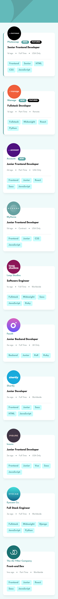
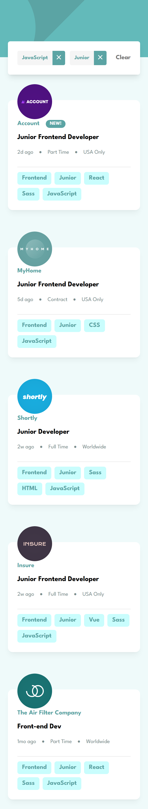
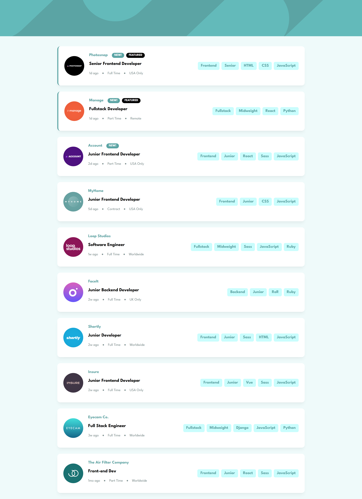
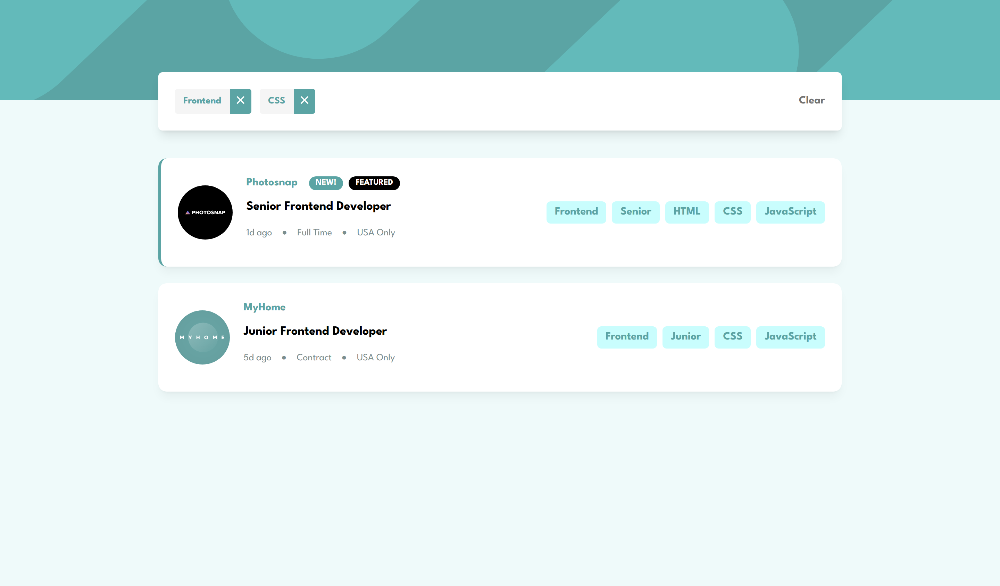

# Frontend Mentor - Job listings with filtering solution

This is a solution to the [Job listings with filtering challenge on Frontend Mentor](https://www.frontendmentor.io/challenges/job-listings-with-filtering-ivstIPCt). Frontend Mentor challenges help you improve your coding skills by building realistic projects. 

## Table of contents

- [Overview](#overview)
  - [The challenge](#the-challenge)
  - [Screenshot](#screenshot)
  - [Links](#links)
- [My process](#my-process)
  - [Built with](#built-with)
  - [What I learned](#what-i-learned)
  - [Continued development](#continued-development)
  - [Useful resources](#useful-resources)
  - [AI Collaboration](#ai-collaboration)
- [Author](#author)


## Overview

### The challenge

Users should be able to:

- View the optimal layout for the site depending on their device's screen size
- See hover states for all interactive elements on the page
- Filter job listings based on the categories

### Screenshot







### Links

- Solution URL:(https://github.com/Dev-sadeeq/job-listings-app)
- Live Site URL: (https://dev-sadeeq.github.io/job-listings-app/)

### Built with

- Semantic HTML5 markup
- Mobile-first workflow
- Vanilla JavaScript (ES6+) for state management and DOM manipulation
- Tailwind CSS v4 for utility-first styling and layout structure
- Flexbox for responsive element alignment


### What I learned

Building this application entirely with vanilla JavaScript and Tailwind helped solidify my understanding of centralized state synchronization, event delegation, and array filtering methods (`.filter()`, `.every()`). 

Here are a few code snippets I am proud of from the build:

```html
<!-- Preventing awkward text breaking at the 768px breakpoint -->
<div class="flex items-center gap-x-3 text-neutral-gray-400 text-sm whitespace-nowrap">
  <span>${data.postedAt}</span>
  <span>&bull;</span>
  <span>${data.contract}</span>
  <span>&bull;</span>
  <span>${data.location}</span>
</div>
```
```js
// Efficient event delegation to handle dynamic filter button clicks
jobContainer.addEventListener('click', (e) => {
  if (e.target.classList.contains('btn')) {
    const selectedTag = e.target.textContent.trim();
    if (!clickedItems.includes(selectedTag)) {
      clickedItems.push(selectedTag);
      updateApp();
    }
  }
});
```

### Continued development

Moving forward, I want to continue refining my skills in component-driven architecture using vanilla JavaScript and exploring advanced layout strategies with modern CSS tools.

### Useful resources

- [MDN Web Docs] (https://developer.mozilla.org/en-US/) - Essential for verifying array iteration and manipulation methods
- [Tailwind CSS Documentation] (https://www.example.com) - Helped structure responsive breakpoints, flex containers, and custom utility layouts cleanly

### AI Collaboration

Gemini AI was utilized during this project as a collaborative partner to debug layout shift behaviors across breakpoints, optimize state management logic with a centralized updateApp() controller, and review responsive wrappers

## Author

- Frontend Mentor - [@Dev-sadeeq](https://www.frontendmentor.io/profile/Dev-sadeeq)
- Twitter - [@Dev_sadeeq](https://www.twitter.com/Dev_sadeeq)

